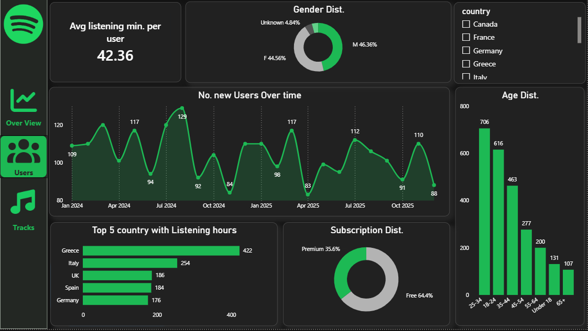
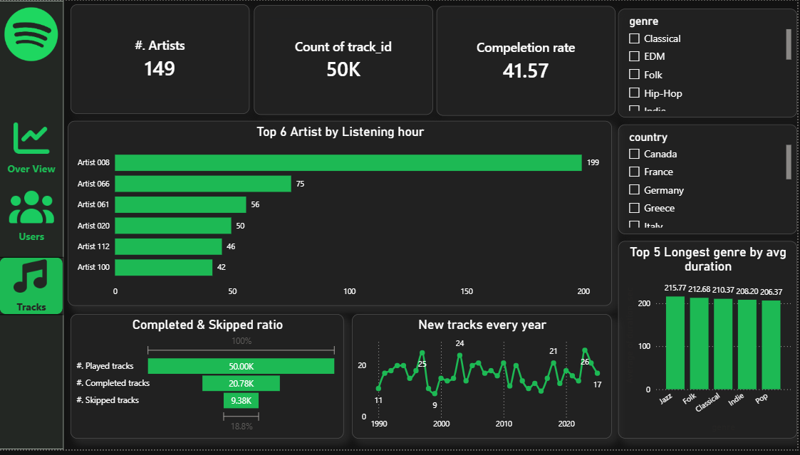

# 🎧 Spotify Music Analytics Dashboard

A Spotify-inspired interactive analytics dashboard built using Power BI to analyze music streaming behavior, user engagement, and content performance.

---

# 📌 Project Overview

This project focuses on analyzing music listening data to uncover insights about:

- User listening behavior
- Top-performing genres and artists
- Device usage patterns
- User demographics
- Track completion and skip rates

The dashboard is designed with a Spotify-inspired dark theme to provide both a modern and engaging user experience.

---

# 🎯 Business Problem

Music streaming platforms generate massive amounts of listening data every day.  
The challenge is turning this raw data into meaningful insights that help answer questions like:

- Which genres are most popular?
- What devices do users prefer?
- Which tracks are skipped the most?
- What user segments are most active?

This dashboard helps stakeholders monitor performance and make data-driven decisions.

---

# 🛠 Tools & Technologies

- Power BI
- DAX
- Power Query
- Data Modeling
- Data Visualization

---

# 🪢 Data Model

The dashboard follows a Star Schema model.

### Fact Table:
- fact_listens

### Dimension Tables:
- dim_user
- dim_track
- dim_device
- dim_geo
- dim_date

This structure improves performance and supports scalable analytics.

---

# 📊 Dashboard Pages

---

## 1️⃣ Cover Page

Spotify-themed landing page.

---

## 2️⃣ Executive Overview

Main KPIs and overall performance metrics.

### KPIs:
- Total Listening Hours
- Total Tracks
- Total Users

### Insights:
- Top Genres by Listening Hours
- Listening Trend Over Time
- Device Usage Distribution

---

## 3️⃣ User Analytics

Detailed user behavior and demographic analysis.

### KPIs:
- Average Listening Minutes per User
- User Growth Trends

### Insights:
- Gender Distribution
- Age Distribution
- Subscription Distribution
- Top Countries by Listening Hours

---

## 4️⃣ Track & Artist Analytics

Track performance and content engagement analysis.

### KPIs:
- Total Artists
- Total Tracks Played
- Completion Rate

### Insights:
- Top Artists
- Completed vs Skipped Ratio
- New Tracks by Year
- Longest Genres by Average Duration

---

# 📈 Key Insights

- Indie is the most popular genre based on listening hours.
- Free users dominate the platform subscription base.
- Smart Speakers and Mobile devices are among the most used platforms.
- Completion rate indicates moderate user engagement with tracks.
- Certain artists significantly outperform others in listening hours.

---

# 📌 Key Features

✔ Interactive Filters  
✔ Drill-down Analysis  
✔ KPI Monitoring  
✔ Trend Analysis  
✔ Modern UI Design  

---

# 🚀 Project Highlights

This project helped me improve my skills in:

- Dashboard Design
- Data Storytelling
- KPI Development
- DAX Calculations
- Business Insight Generation

---

⭐ If you found this project useful, feel free to star the repository.